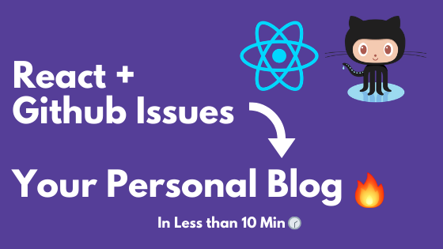

<h1 align="center">
  React Blog 
</h1>

<h2 align="center">
  React + Github Issues 👉 Your Personal Blog 🔥 
</h2>

<p align="center">
  React Blog is a personal blog system build on React that helps you create your own personal blog using Github Issues  
</p>

<p align="center"> 
  <kbd>
</img>
  </kbd>
</p>

---

## :fire: Features

:white_check_mark: Own your content \
:white_check_mark: Write using Markdown On Github Issues \
:white_check_mark: Syntax/Code Highlighting \
:white_check_mark: Fully customizable \
:white_check_mark: Tags - Topics  \
:white_check_mark: Links \
:white_check_mark: Reactions  \
:white_check_mark: Images \
:white_check_mark: Minutes Read \
:white_check_mark: Beautiful UI Like Medium \
:white_check_mark: Easy deployment: Using Github Pages \
:white_check_mark: Instant Effects on Blog when changing github issues \
:white_check_mark: Beautiful blockquote   


## :link: Live Demo

Here's a [live demo](https://saadpasta.github.io/react-blog-github/#/)

Github [Issues / Blogs](https://github.com/saadpasta/react-blog-github/issues)


--- 

## 🚀 Get Up and Running in 10 Minutes
You can get a react-blog site up and running on your local dev environment in 10 minutes with these five steps:

These instructions will get you a copy of the project up and running on your local machine for development and testing purposes.

You'll need [Git](https://git-scm.com) and [Node.js](https://nodejs.org/en/download/) (which comes with [npm](http://npmjs.com)) installed on your computer

```
node@v10.16.0 or higher
npm@6.9.0 or higher
git@2.17.1 or higher

```

### 1. From your command line, clone and run react-blog-github:

```bash
# Clone this repository
$ git clone https://github.com/username/react-blog-github.git

# Go into the repository
$ cd react-blog-github

# Install dependencies
$ npm install

```

### 2. **Generate a Github Personal Access Token.**

Generate a Github personal access token using these [Instructions](https://help.github.com/en/github/authenticating-to-github/creating-a-personal-access-token-for-the-command-line) `Make sure you don't select any scope just generate a simple token without any scope`

After that copy your generated token and then encode your token into base 64 using this [Website](http://www.utilities-online.info/base64/)

`Copy your base64 converted token`

### 3. Create a GitHub App

Go on the following URL: https://github.com/settings/apps/new

There are a few fields to fill carefully:
- Homepage URL: https://your_username.github.io/react-blog-github/
- Callback URL: https://your_username.github.io/react-blog-github/
- Check "Request user authorization (OAuth) during installation"

In permissions & events, set `Read & Write` on Issues
In "Install App", install the app on your user and select your repository

### 4. **Change `/src/config.js`.**
Go to your cloned repository and make the following changes in `/src/config.js`

```javascript
export const config = {
  // Your Github Converted Token To Know How To Get Your Token Look at Readme.md
  githubConvertedToken: "Your token here",

  // Your Github UserName
  githubUserName: "Your username here",

  // Your Github Repo Name Where You Have your issues as Blog
  githubRepo: "Your repo's name here",

  // Set it to true if you have a Github app to add to this project
  // and fill the client ID & secret
  enableOAuth: true,
  OAuthClientID: 'Github App Client ID',
  OAuthSecret: 'Github App Secret',

  // Your Personal Blog Title
  title : "Title of your blog" ,

  // Your Personal Blog Subtitle
  subtitle : "Subtitle of your blog",

  // Header customization
  header: {
    backgroundColor: '#f1f6f8', // can be a CSS gradient
    titleColor: '#ff5252',
    subtitleColor: '#37474f',
  },
};
```

### 5. **Write A Blog.**
After doing following changes now you just need to write a blog on repository issues that you have mentioned in your `config.js`

- Open your repository [github issues](https://github.com/saadpasta/react-blog-github/issues)
- Create a new issue 
- Now write your blog in github issue in markdown. You can also use [slack edit](https://stackedit.io/app#) to write your markdown
- Add a label `blog` on your github issue to make it different from other standard issues. Keep in mind `blog` label is mandatory otherwise it won't show on your website.

### 6. **Start Your React App.**
That's it now you just need to start your react application From your command line run . 

```bash
# Run
$ npm start

```

--- 

## 🛠️ Technologies used 
This project is only possible thanks to the awesomeness of the following projects:

- [React](https://reactjs.org/)
- [graphql](https://graphql.org/) 
- [apollo-boost](https://www.apollographql.com/docs/react/get-started/) 
- [GitHub](https://github.com)
- [markdown-to-jsx](https://probablyup.com/markdown-to-jsx/)
- [React Syntax Highlighter](https://github.com/conorhastings/react-syntax-highlighter)
- [react-reactions](https://casesandberg.github.io/react-reactions/)


## :seedling: Inspiration
This project is inspired from many other similar projects. 

- [gatsby-theme-blog-with-github](https://github.com/mddanishyusuf/gatsby-theme-blog-with-github)
- [utterances](https://github.com/utterance/utterances)


## 🤝 Contributing

Any idea on how we can make this more awesome ? [Open a new issue](https://github.com/saadpasta/react-blog-github/issues)!  We need all the help we can get to make this project awesome!

## :boom: Todo
- Add Comment From Github
- Authentication using Github
- Footer 
- Header
- Social Media Sharing


## 📄 License 

This project is licensed under the MIT License - see the [LICENSE.md](./LICENSE) file for details

## Contributors ✨

Thanks goes to these wonderful people ([emoji key](https://allcontributors.org/docs/en/emoji-key)):

<!-- ALL-CONTRIBUTORS-LIST:START - Do not remove or modify this section -->
<!-- prettier-ignore-start -->
<!-- markdownlint-disable -->
<table>
  <tr>
    <td align="center"><a href="http://github.com/MuhammadHammad"><br /><sub><b>SyedMuhammadHammadGhani</b></sub></a><br /><a href="https://github.com/saadpasta/react-blog-github/commits?author=Muhammad-Hammad" title="Documentation">📖</a></td>
    <td align="center"><a href="http://saadpasta.github.io"><br /><sub><b>Saad Pasta</b></sub></a><br /><a href="https://github.com/saadpasta/react-blog-github/commits?author=saadpasta" title="Code">💻</a> <a href="https://github.com/saadpasta/react-blog-github/commits?author=saadpasta" title="Documentation">📖</a> <a href="#design-saadpasta" title="Design">🎨</a> <a href="#maintenance-saadpasta" title="Maintenance">🚧</a></td>
    <td align="center"><a href="https://github.com/jvm-odoo"><br /><sub><b>Jason Van Malder</b></sub></a><br /><a href="https://github.com/saadpasta/react-blog-github/commits?author=jvm-odoo" title="Code">💻</a> <a href="#infra-jvm-odoo" title="Infrastructure (Hosting, Build-Tools, etc)">🚇</a></td>
    <td align="center"><a href="https://github.com/viveksharmaui"><br /><sub><b>Slim Coder</b></sub></a><br /><a href="https://github.com/saadpasta/react-blog-github/commits?author=viveksharmaui" title="Code">💻</a></td>
    <td align="center"><a href="https://github.com/waleed345"><br /><sub><b>waleed345</b></sub></a><br /><a href="https://github.com/saadpasta/react-blog-github/commits?author=waleed345" title="Code">💻</a></td>
  </tr>
</table>

<!-- markdownlint-enable -->
<!-- prettier-ignore-end -->
<!-- ALL-CONTRIBUTORS-LIST:END -->

This project follows the [all-contributors](https://github.com/all-contributors/all-contributors) specification. Contributions of any kind welcome!
